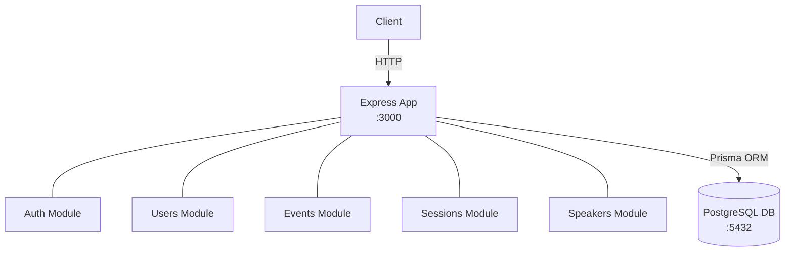
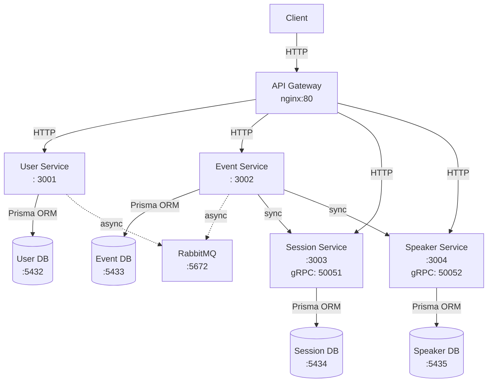

# Backend Architecture Comparison - Monolith vs Microservices

This project demonstrates two different backend architectures for the same event management system:
- **Monolithic Architecture** - Traditional single application approach
- **Microservices Architecture** - Distributed system with independent services

## Project Structure

- `/diagrams` - Architecture diagrams and communication flows (Mermaid)
- `/monolith` - Monolithic implementation (single codebase, single database)
- `/microservices` - Microservices implementation (4 services, 4 databases, RabbitMQ, gRPC)

## Architecture Comparison

### Monolith Architecture


**Characteristics:**
- 1 application in Node.js/TypeScript
- 1 PostgreSQL database
- 1 process for everything
- Shared code between modules
- Simple ACID transactions

### Microservices Architecture


**Characteristics:**
- 4 independent services
- 4 isolated databases
- RabbitMQ for async messaging
- gRPC for sync communication
- Nginx as API Gateway

## When to Use Each Architecture

### Use Monolith When:
- Small team (< 10 people)  
- MVP or early-stage product  
- Simple domain  
- Predictable low traffic  
- Focus on time-to-market  

### Use Microservices When:
- Large team (multiple teams)  
- Mature and complex product  
- Need for independent scaling  
- High traffic with variable peaks  
- Well-defined separate domains  

## Advantages & Trade-offs

### Monolith

**Advantages:**
- Simple to develop and test
- Easy to debug
- Simple transactions
- Less network overhead
- Straightforward deployment

**Trade-offs:**
- Hard to scale specific parts
- Single point of failure
- Difficult for large teams
- Deploy everything together
- Single tech stack

### Microservices

**Advantages:**
- Independent scaling per service
- Fault isolation
- Team autonomy
- Independent deployment
- Technology flexibility

**Trade-offs:**
- Increased complexity
- Network latency
- Eventual consistency
- Complex DevOps
- Distributed debugging

## Features

### User Management
- **User Registration** - Create account with email/password
- **User Login** - JWT-based authentication
- **Profile Management** - View and update own profile
- **Password Change** - Secure password updates
- **User Listings** - Admin can list all users
- **Soft Delete** - Users marked as deleted, not removed

### Event Management
- **Create Events** - Admins can create new events
- **List Events** - Public access to all active events
- **Event Details** - View full event info with sessions and speakers
- **Update Events** - Admins can modify event details
- **Delete Events** - Soft delete with data preservation
- **Event Enrollment** - Users can enroll/leave events
- **Enrollment Tracking** - View all enrolled users

### Session Management
- **Create Sessions** - Link sessions to events
- **Session Types** - WORKSHOP, TALK, PANEL, NETWORKING
- **List Sessions** - Filter by event
- **Session Details** - Full info with speakers and attendees
- **Update Sessions** - Modify session information
- **Delete Sessions** - Soft delete support
- **Speaker Assignment** - Add/remove speakers to sessions
- **Attendance Tracking** - Mark user attendance

### Speaker Management
- **Create Speakers** - Add speaker profiles
- **List Speakers** - View all speaker profiles
- **Speaker Details** - Full bio with session history
- **Update Speakers** - Modify speaker information
- **Delete Speakers** - Soft delete support
- **Session Linking** - Track speaker sessions

### Security & Authentication
- **Password Hashing** - bcrypt with 10 salt rounds
- **JWT Tokens** - Access (15min) + Refresh (7d) tokens
- **Role-Based Access Control** - USER/ADMIN roles
- **Input Validation** - Zod schemas on all endpoints
- **Security Headers** - Helmet.js protection
- **CORS** - Cross-origin resource sharing
- **Protected Routes** - Middleware-based auth
- **Permission Checks** - Granular access control

### Technical Features
- **TypeScript** - Full type safety
- **Prisma ORM** - Type-safe database access
- **PostgreSQL** - Relational database
- **Error Handling** - Centralized error middleware
- **Winston Logging** - File and console logs
- **Docker Support** - Containerized deployment
- **Hot Reload** - Development with ts-node-dev
- **API Documentation** - Complete endpoint docs

## Tech Stack

### Common (Both Architectures)
- **Runtime:** Node.js 18+ with TypeScript
- **Framework:** Express.js
- **Database:** PostgreSQL 15
- **ORM:** Prisma
- **Authentication:** JWT + bcrypt
- **Validation:** Zod
- **Logging:** Winston
- **Containerization:** Docker + Docker Compose

### Additional (Microservices Only)
- **Message Broker:** RabbitMQ 3.12
- **RPC:** gRPC
- **API Gateway:** Nginx

## Database Structure

### Monolith - Single Database
All tables in one database:
```
users, user_events, user_sessions,
events, event_sessions,
sessions, session_speakers,
speakers
```

### Microservices - Database per Service
```
User DB:     users, user_sessions
Event DB:    events, user_events, event_sessions
Session DB:  sessions, session_speakers
Speaker DB:  speakers
```

**Note:** No foreign keys across databases - integrity maintained by services.

## Communication Patterns

### Monolith
- Direct function calls
- ACID transactions
- No network latency

### Microservices
- **HTTP/REST:** Client → Gateway → Services
- **RabbitMQ:** Async events between services
    - `user.enrolled` - Event enrollment notification
    - `session.created` - New session created
    - `speaker.updated` - Speaker updated
- **gRPC:** Synchronous validations
    - Session validation (port 50051)
    - Speaker validation (port 50052)
- Eventual consistency

## Learning Objectives

This project demonstrates:

1. **Monolithic Architecture**
- When to use it
- Advantages and limitations
- Code organization patterns

2. **Microservices Architecture**
- Domain decomposition
- Inter-service communication
- Database per service pattern
- Event-driven architecture
- API Gateway pattern

3. **Practical Comparison**
- Same functionality, different architectures
- Real-world trade-offs
- Decision criteria for each approach

## Documentation

Each implementation has complete documentation:

### Monolith
- **[monolith/README.md](./monolith/README.md)** - Overview and architecture
- **[monolith/SETUP.md](./monolith/SETUP.md)** - Setup instructions
- **[monolith/API.md](./monolith/API.md)** - Complete API documentation

### Microservices
- **[microservices/README.md](./microservices/README.md)** - Overview and architecture
- **[microservices/SETUP.md](./microservices/SETUP.md)** - Setup instructions
- **[microservices/API.md](./microservices/API.md)** - Complete API documentation

## License

This project is part of the EPIC Júnior Backend and Databases course.