# Communication Flows

This document illustrates the detailed communication patterns between services in both monolithic and microservices architectures.

## 1. User Registration & Login Flow

### Monolithic Architecture

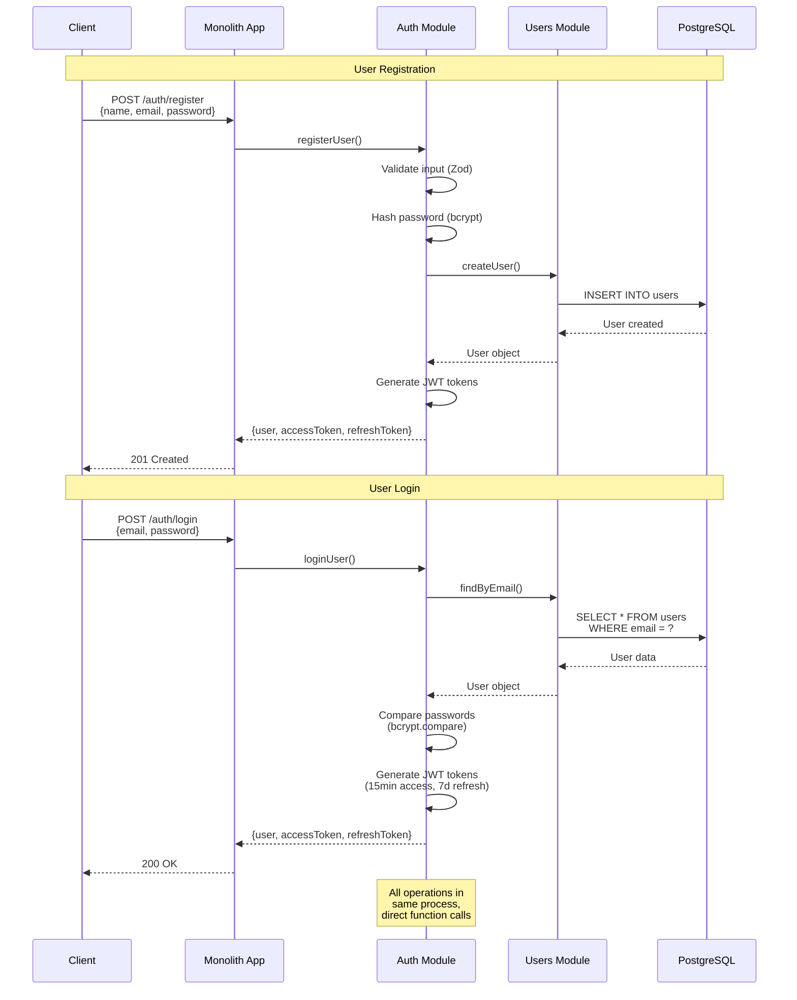

### Microservices Architecture

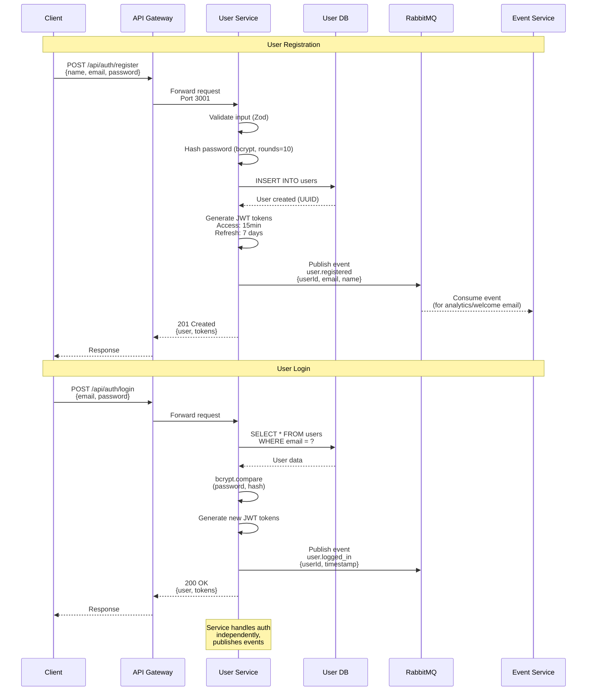

## 2. User Enrolling in Event

### Monolithic Architecture

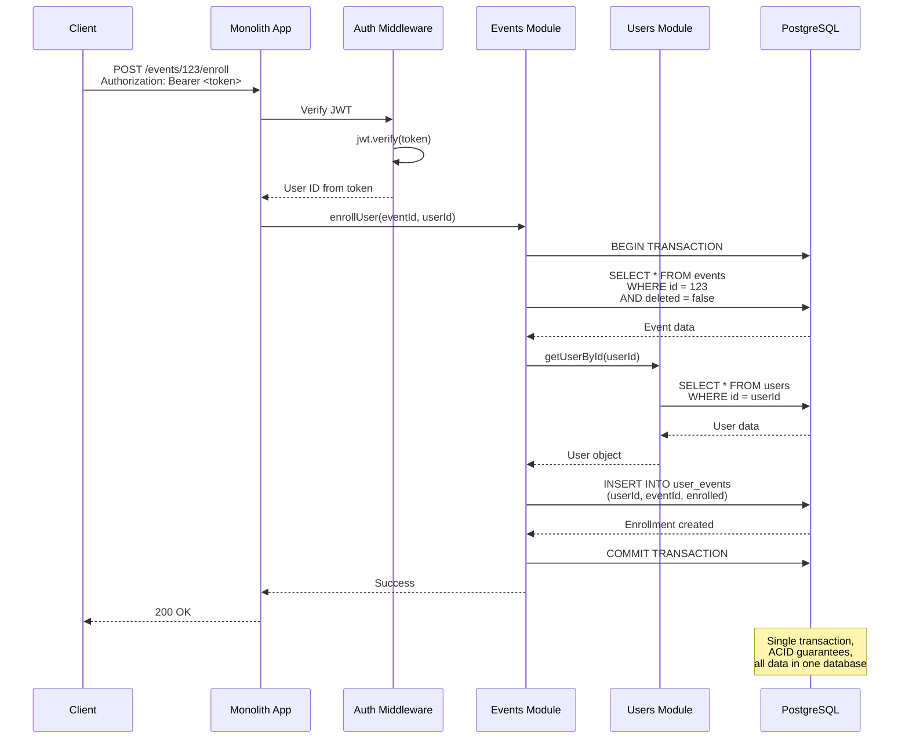

### Microservices Architecture

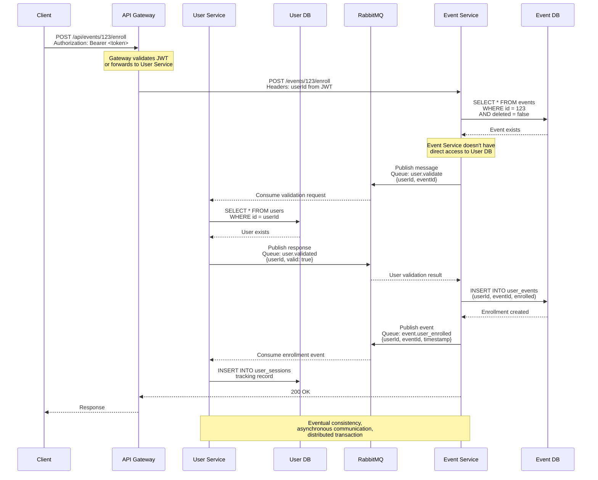

## 3. Adding Speaker to Session (gRPC Sync Call)

### Monolithic Architecture

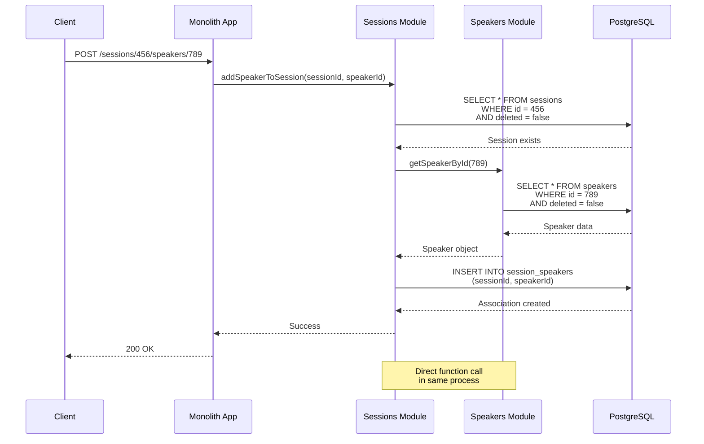

### Microservices Architecture (gRPC)

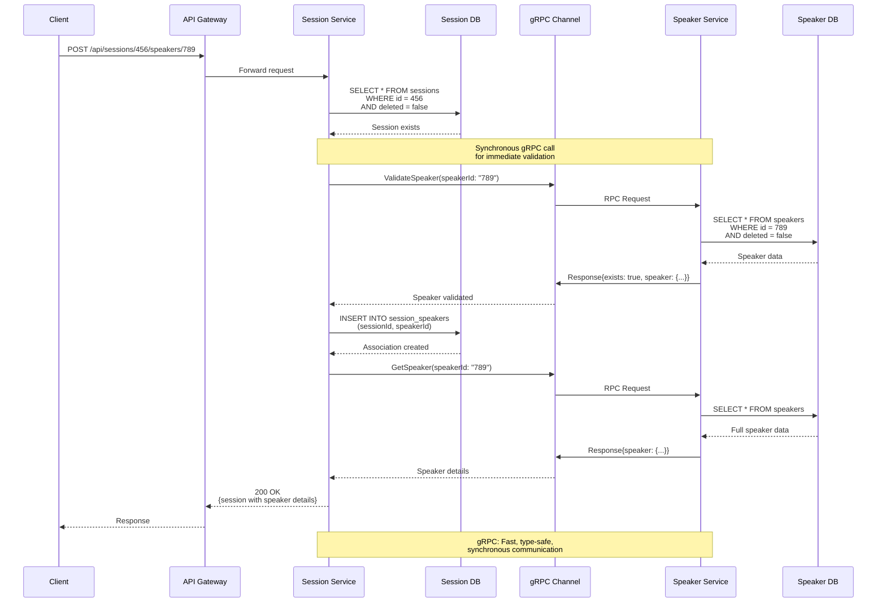

## 4. User Attending Session

### Monolithic Architecture

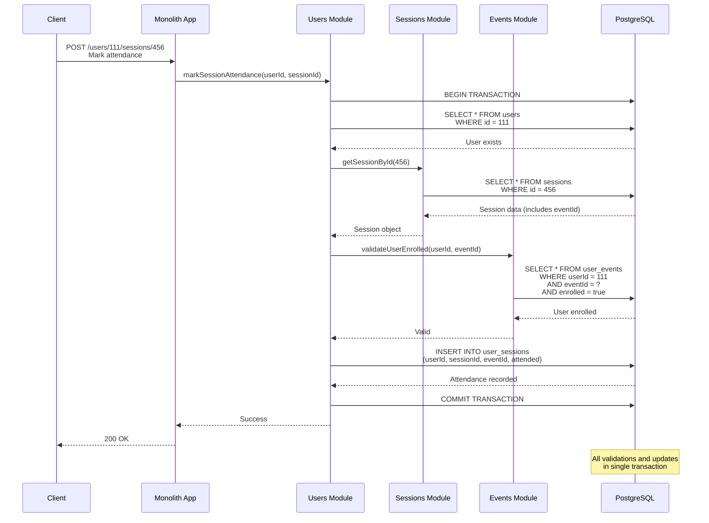

### Microservices Architecture

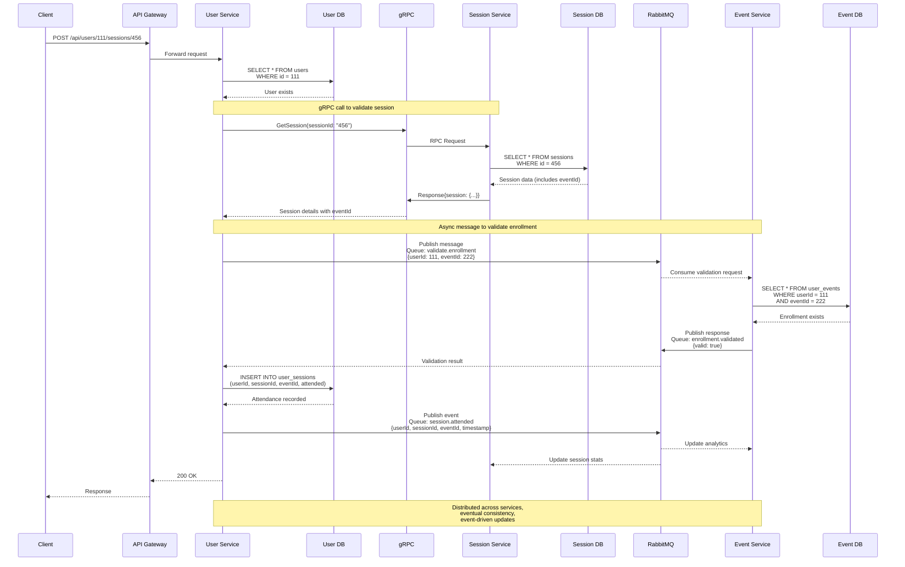

## Communication Patterns Comparison

### Synchronous vs Asynchronous

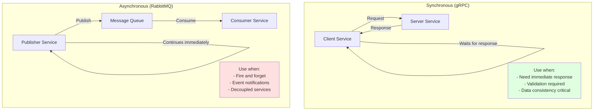

## Error Handling Patterns

### Monolithic - Simple Error Propagation

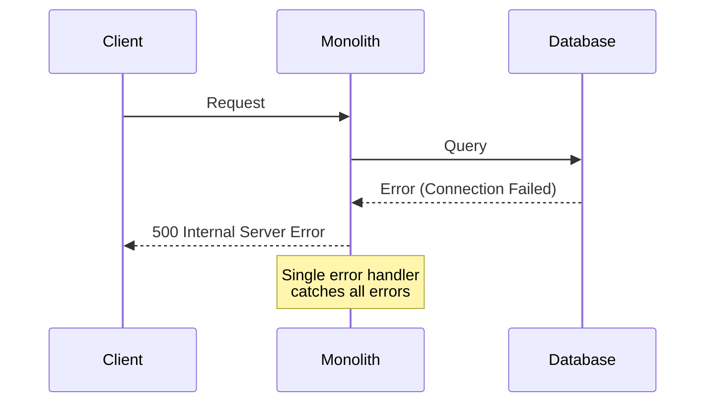

### Microservices - Distributed Error Handling

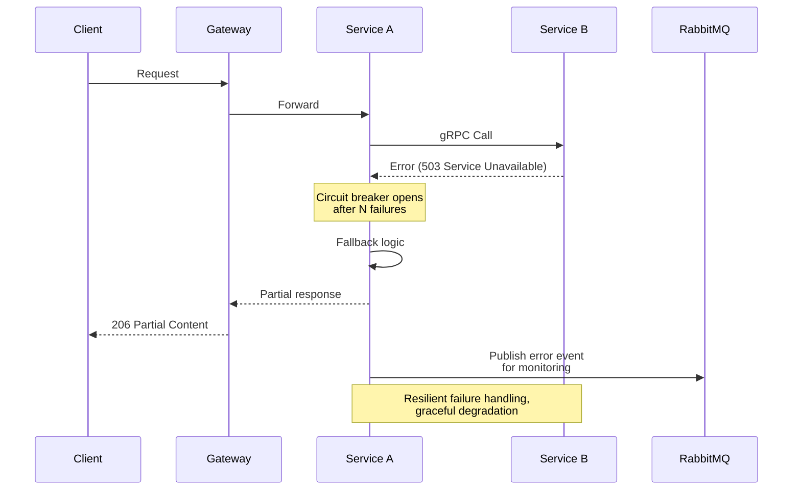

## Performance Comparison

### Monolithic - Low Latency

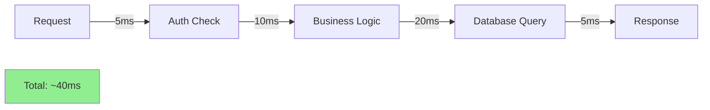

### Microservices - Higher Latency

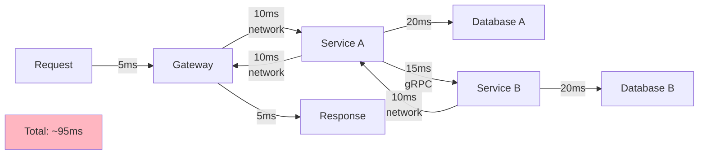

**Trade-off**: Microservices add network latency but provide better scalability and resilience.