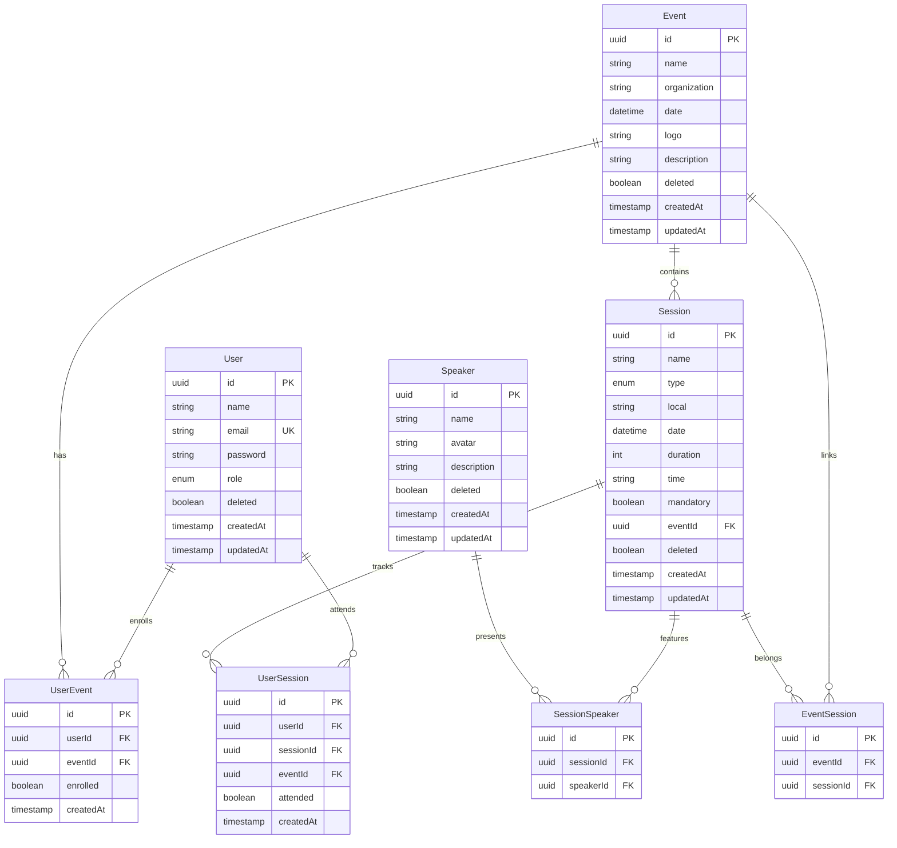
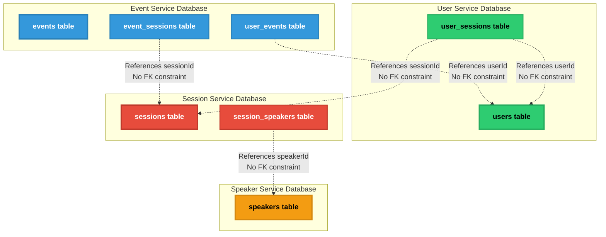
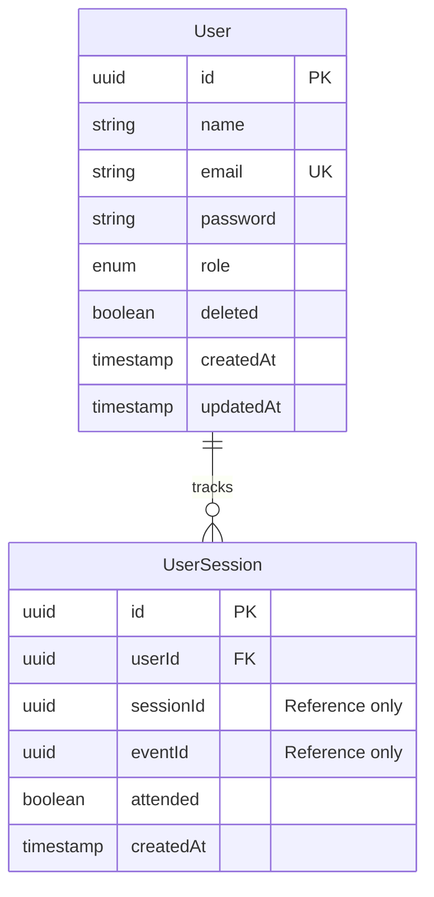
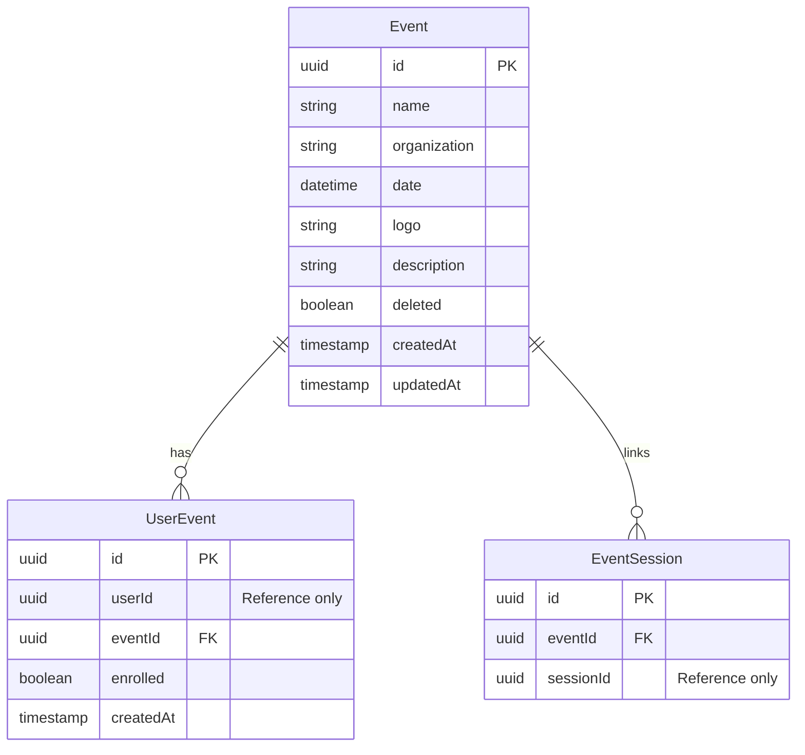
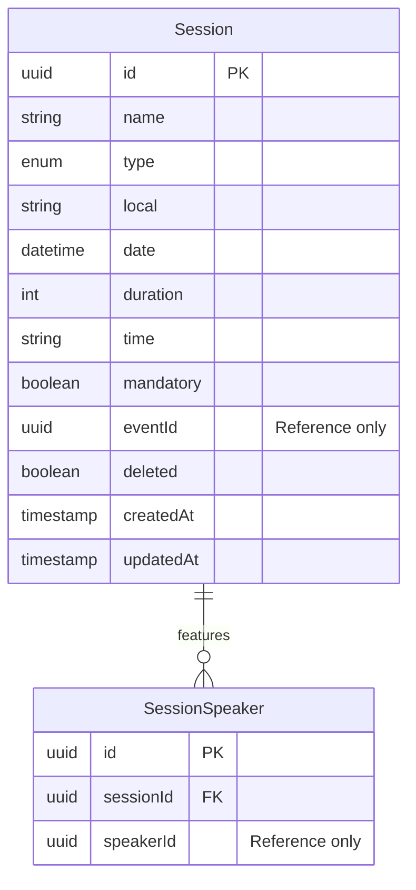
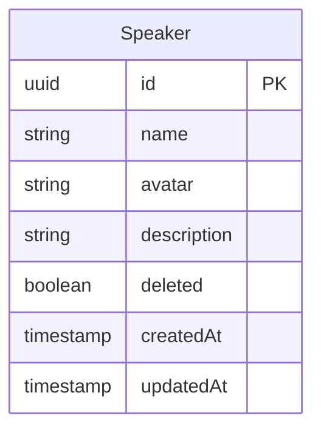
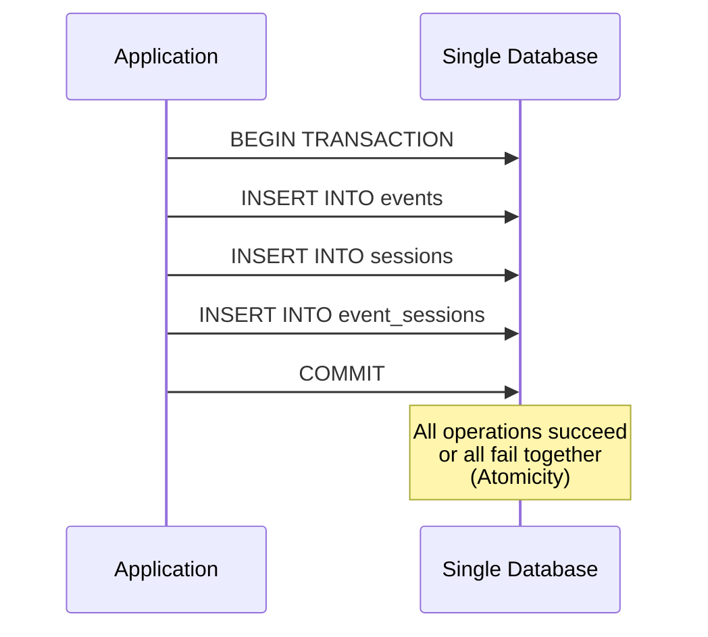
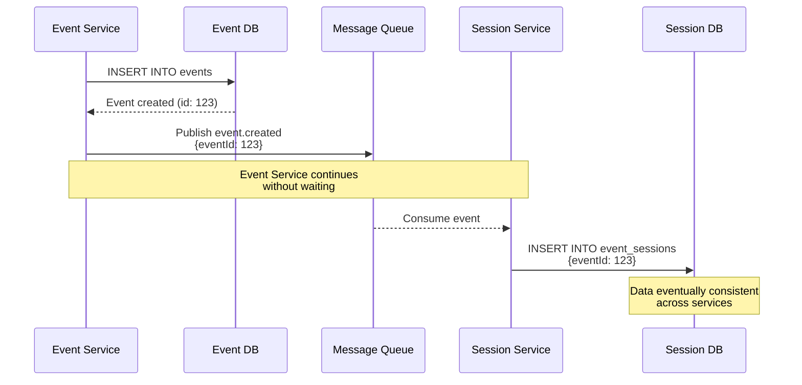
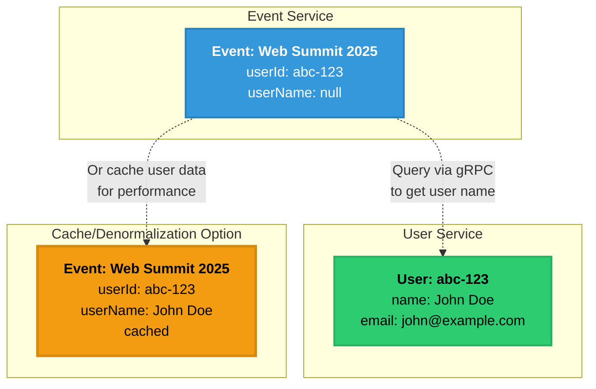
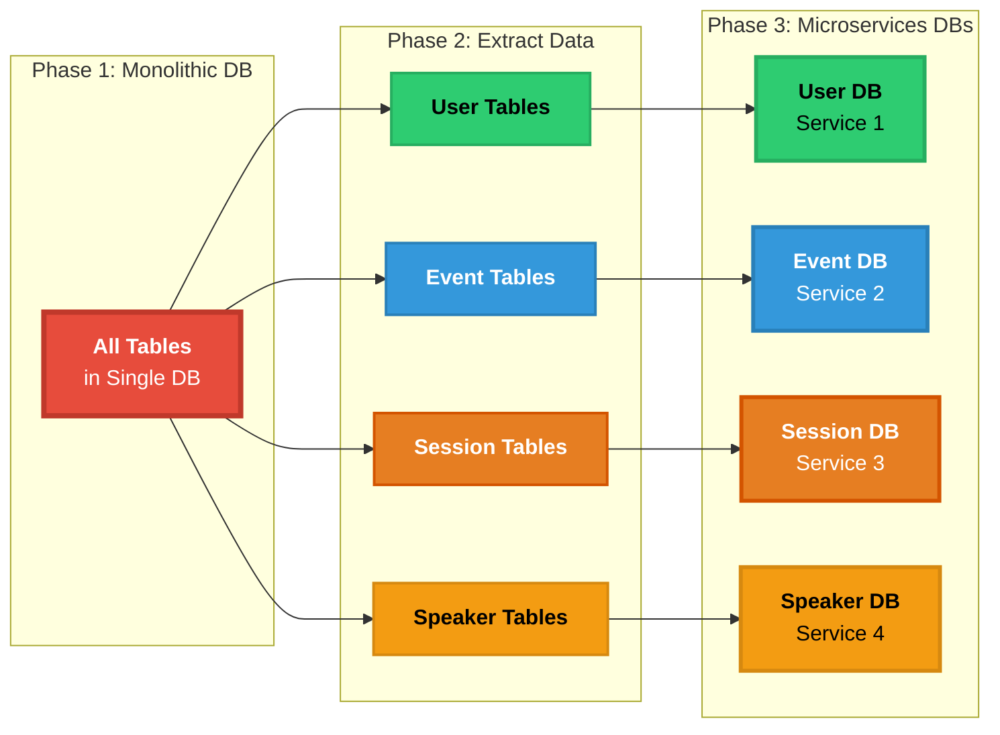

# Database Schemas

This document provides detailed entity-relationship diagrams for both monolithic and microservices database designs.

## Monolithic Architecture - Single Database

### Complete ER Diagram



### Table Details

#### Users Table
```sql
CREATE TABLE users (
    id UUID PRIMARY KEY DEFAULT gen_random_uuid(),
    name VARCHAR(255) NOT NULL,
    email VARCHAR(255) UNIQUE NOT NULL,
    password VARCHAR(255) NOT NULL,  -- bcrypt hash
    role VARCHAR(20) DEFAULT 'USER', -- USER, ADMIN
    deleted BOOLEAN DEFAULT FALSE,
    created_at TIMESTAMP DEFAULT NOW(),
    updated_at TIMESTAMP DEFAULT NOW()
);

CREATE INDEX idx_users_email ON users(email);
CREATE INDEX idx_users_deleted ON users(deleted);
```

#### Events Table
```sql
CREATE TABLE events (
    id UUID PRIMARY KEY DEFAULT gen_random_uuid(),
    name VARCHAR(255) NOT NULL,
    organization VARCHAR(255) NOT NULL,
    date TIMESTAMP NOT NULL,
    logo VARCHAR(500),
    description TEXT NOT NULL,
    deleted BOOLEAN DEFAULT FALSE,
    created_at TIMESTAMP DEFAULT NOW(),
    updated_at TIMESTAMP DEFAULT NOW()
);

CREATE INDEX idx_events_date ON events(date);
CREATE INDEX idx_events_deleted ON events(deleted);
```

#### Sessions Table
```sql
CREATE TABLE sessions (
    id UUID PRIMARY KEY DEFAULT gen_random_uuid(),
    name VARCHAR(255) NOT NULL,
    type VARCHAR(50) NOT NULL, -- WORKSHOP, TALK, PANEL, NETWORKING
    local VARCHAR(255) NOT NULL,
    date TIMESTAMP NOT NULL,
    duration INT NOT NULL, -- minutes
    time VARCHAR(10) NOT NULL, -- HH:MM format
    mandatory BOOLEAN DEFAULT FALSE,
    event_id UUID NOT NULL REFERENCES events(id),
    deleted BOOLEAN DEFAULT FALSE,
    created_at TIMESTAMP DEFAULT NOW(),
    updated_at TIMESTAMP DEFAULT NOW()
);

CREATE INDEX idx_sessions_event ON sessions(event_id);
CREATE INDEX idx_sessions_type ON sessions(type);
CREATE INDEX idx_sessions_deleted ON sessions(deleted);
```

#### Speakers Table
```sql
CREATE TABLE speakers (
    id UUID PRIMARY KEY DEFAULT gen_random_uuid(),
    name VARCHAR(255) NOT NULL,
    avatar VARCHAR(500),
    description TEXT NOT NULL,
    deleted BOOLEAN DEFAULT FALSE,
    created_at TIMESTAMP DEFAULT NOW(),
    updated_at TIMESTAMP DEFAULT NOW()
);

CREATE INDEX idx_speakers_deleted ON speakers(deleted);
```

#### Junction Tables

```sql
-- User enrollment in events
CREATE TABLE user_events (
    id UUID PRIMARY KEY DEFAULT gen_random_uuid(),
    user_id UUID NOT NULL REFERENCES users(id),
    event_id UUID NOT NULL REFERENCES events(id),
    enrolled BOOLEAN DEFAULT TRUE,
    created_at TIMESTAMP DEFAULT NOW(),
    UNIQUE(user_id, event_id)
);

-- User attendance in sessions
CREATE TABLE user_sessions (
    id UUID PRIMARY KEY DEFAULT gen_random_uuid(),
    user_id UUID NOT NULL REFERENCES users(id),
    session_id UUID NOT NULL REFERENCES sessions(id),
    event_id UUID NOT NULL,
    attended BOOLEAN DEFAULT FALSE,
    created_at TIMESTAMP DEFAULT NOW(),
    UNIQUE(user_id, session_id)
);

-- Event-Session relationship
CREATE TABLE event_sessions (
    id UUID PRIMARY KEY DEFAULT gen_random_uuid(),
    event_id UUID NOT NULL REFERENCES events(id),
    session_id UUID NOT NULL,
    UNIQUE(event_id, session_id)
);

-- Session-Speaker relationship
CREATE TABLE session_speakers (
    id UUID PRIMARY KEY DEFAULT gen_random_uuid(),
    session_id UUID NOT NULL REFERENCES sessions(id),
    speaker_id UUID NOT NULL REFERENCES speakers(id),
    UNIQUE(session_id, speaker_id)
);
```

---

## Microservices Architecture - Distributed Databases

### Database Per Service Pattern



### 1. User Service Database



**Schema:**
```sql
-- User Service Database (Port 5432)
CREATE TABLE users (
    id UUID PRIMARY KEY DEFAULT gen_random_uuid(),
    name VARCHAR(255) NOT NULL,
    email VARCHAR(255) UNIQUE NOT NULL,
    password VARCHAR(255) NOT NULL,
    role VARCHAR(20) DEFAULT 'USER',
    deleted BOOLEAN DEFAULT FALSE,
    created_at TIMESTAMP DEFAULT NOW(),
    updated_at TIMESTAMP DEFAULT NOW()
);

CREATE TABLE user_sessions (
    id UUID PRIMARY KEY DEFAULT gen_random_uuid(),
    user_id UUID NOT NULL REFERENCES users(id),
    session_id UUID NOT NULL, -- No FK to sessions (different DB)
    event_id UUID NOT NULL,   -- No FK to events (different DB)
    attended BOOLEAN DEFAULT FALSE,
    created_at TIMESTAMP DEFAULT NOW(),
    UNIQUE(user_id, session_id)
);

CREATE INDEX idx_users_email ON users(email);
CREATE INDEX idx_user_sessions_user ON user_sessions(user_id);
```

**Data Ownership:**
- User accounts and authentication
- User session attendance tracking

---

### 2. Event Service Database



**Schema:**
```sql
-- Event Service Database (Port 5433)
CREATE TABLE events (
    id UUID PRIMARY KEY DEFAULT gen_random_uuid(),
    name VARCHAR(255) NOT NULL,
    organization VARCHAR(255) NOT NULL,
    date TIMESTAMP NOT NULL,
    logo VARCHAR(500),
    description TEXT NOT NULL,
    deleted BOOLEAN DEFAULT FALSE,
    created_at TIMESTAMP DEFAULT NOW(),
    updated_at TIMESTAMP DEFAULT NOW()
);

CREATE TABLE user_events (
    id UUID PRIMARY KEY DEFAULT gen_random_uuid(),
    user_id UUID NOT NULL, -- No FK to users (different DB)
    event_id UUID NOT NULL REFERENCES events(id),
    enrolled BOOLEAN DEFAULT TRUE,
    created_at TIMESTAMP DEFAULT NOW(),
    UNIQUE(user_id, event_id)
);

CREATE TABLE event_sessions (
    id UUID PRIMARY KEY DEFAULT gen_random_uuid(),
    event_id UUID NOT NULL REFERENCES events(id),
    session_id UUID NOT NULL, -- No FK to sessions (different DB)
    UNIQUE(event_id, session_id)
);

CREATE INDEX idx_events_date ON events(date);
CREATE INDEX idx_user_events_user ON user_events(user_id);
CREATE INDEX idx_user_events_event ON user_events(event_id);
```

**Data Ownership:**
- Event information
- User enrollments in events
- Event-session associations

---

### 3. Session Service Database



**Schema:**
```sql
-- Session Service Database (Port 5434)
CREATE TABLE sessions (
    id UUID PRIMARY KEY DEFAULT gen_random_uuid(),
    name VARCHAR(255) NOT NULL,
    type VARCHAR(50) NOT NULL,
    local VARCHAR(255) NOT NULL,
    date TIMESTAMP NOT NULL,
    duration INT NOT NULL,
    time VARCHAR(10) NOT NULL,
    mandatory BOOLEAN DEFAULT FALSE,
    event_id UUID NOT NULL, -- No FK to events (different DB)
    deleted BOOLEAN DEFAULT FALSE,
    created_at TIMESTAMP DEFAULT NOW(),
    updated_at TIMESTAMP DEFAULT NOW()
);

CREATE TABLE session_speakers (
    id UUID PRIMARY KEY DEFAULT gen_random_uuid(),
    session_id UUID NOT NULL REFERENCES sessions(id),
    speaker_id UUID NOT NULL, -- No FK to speakers (different DB)
    UNIQUE(session_id, speaker_id)
);

CREATE INDEX idx_sessions_event ON sessions(event_id);
CREATE INDEX idx_sessions_type ON sessions(type);
CREATE INDEX idx_session_speakers_session ON session_speakers(session_id);
```

**Data Ownership:**
- Session details (workshops, talks, panels, networking)
- Session-speaker associations

---

### 4. Speaker Service Database



**Schema:**
```sql
-- Speaker Service Database (Port 5435)
CREATE TABLE speakers (
    id UUID PRIMARY KEY DEFAULT gen_random_uuid(),
    name VARCHAR(255) NOT NULL,
    avatar VARCHAR(500),
    description TEXT NOT NULL,
    deleted BOOLEAN DEFAULT FALSE,
    created_at TIMESTAMP DEFAULT NOW(),
    updated_at TIMESTAMP DEFAULT NOW()
);

CREATE INDEX idx_speakers_deleted ON speakers(deleted);
```

**Data Ownership:**
- Speaker profiles
- Speaker information

---

## Data Consistency Patterns

### Monolithic - ACID Transactions



### Microservices - Eventual Consistency



## Handling Data Duplication

### Reference Data Pattern



**Strategies:**
1. **Reference by ID**: Store only foreign IDs, query when needed
2. **Data Caching**: Cache frequently accessed data locally
3. **Event Sourcing**: Replicate data via events for read models
4. **CQRS**: Separate read and write models

## Query Patterns Comparison

### Monolithic - Simple Joins

```sql
-- Get event with all sessions and speakers
SELECT 
    e.id, e.name, e.date,
    s.id as session_id, s.name as session_name,
    sp.id as speaker_id, sp.name as speaker_name
FROM events e
LEFT JOIN sessions s ON s.event_id = e.id
LEFT JOIN session_speakers ss ON ss.session_id = s.id
LEFT JOIN speakers sp ON sp.id = ss.speaker_id
WHERE e.id = '123'
AND e.deleted = false
AND s.deleted = false
AND sp.deleted = false;
```

### Microservices - Multiple Service Calls

```typescript
// Event Service
const event = await eventDb.event.findUnique({ 
    where: { id: '123' } 
});

// gRPC call to Session Service
const sessions = await sessionClient.getSessionsByEvent({ 
    eventId: '123' 
});

// For each session, gRPC call to Speaker Service
const sessionsWithSpeakers = await Promise.all(
    sessions.map(async (session) => {
        const speakers = await speakerClient.getSpeakersBySession({
            sessionId: session.id
        });
        return { ...session, speakers };
    })
);

return {
    ...event,
    sessions: sessionsWithSpeakers
};
```

## Data Migration Considerations

### Monolith to Microservices Migration



**Migration Steps:**
1. Identify service boundaries
2. Extract tables to separate databases
3. Remove foreign key constraints across services
4. Implement service communication (gRPC/RabbitMQ)
5. Update application code to use service APIs
6. Migrate data incrementally