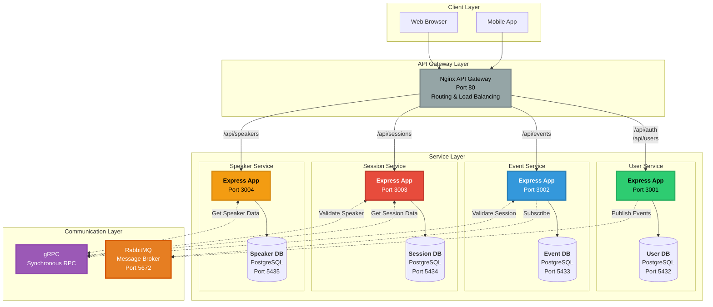
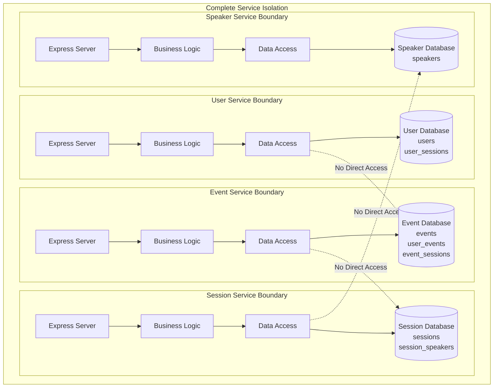
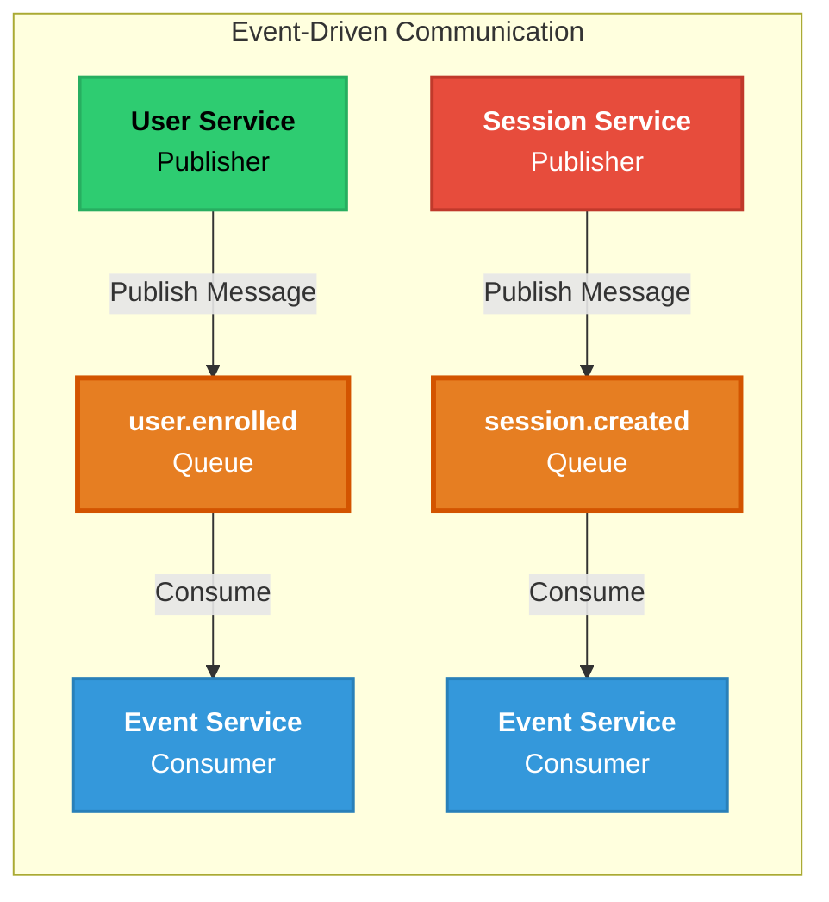
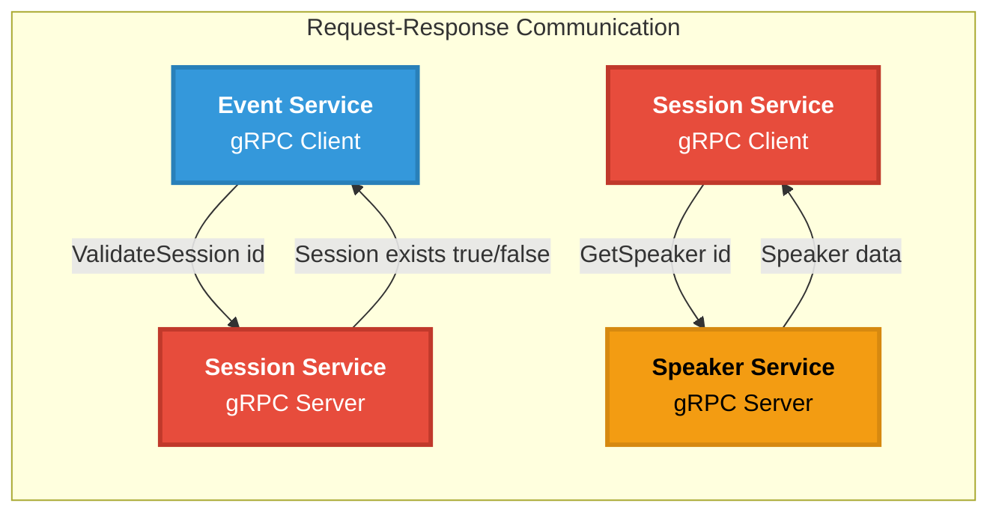
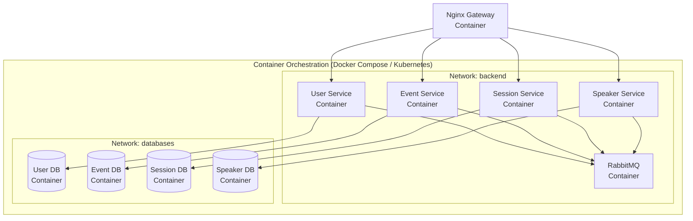
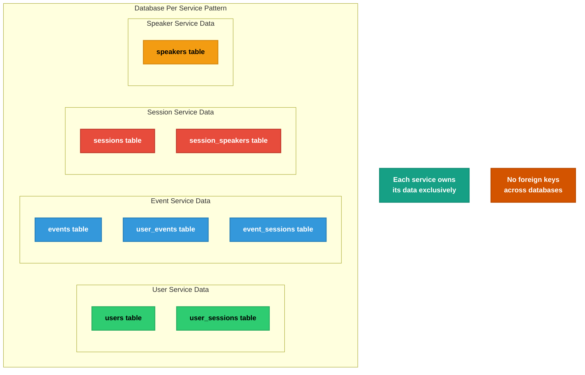
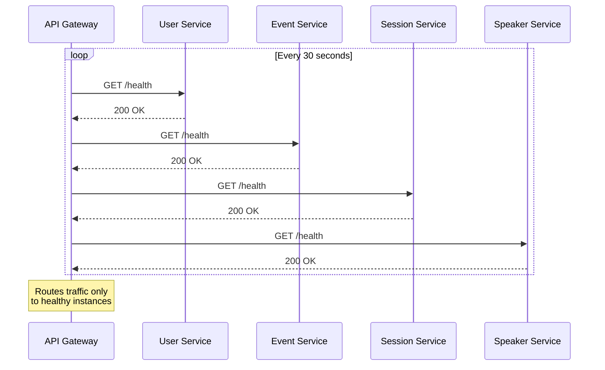
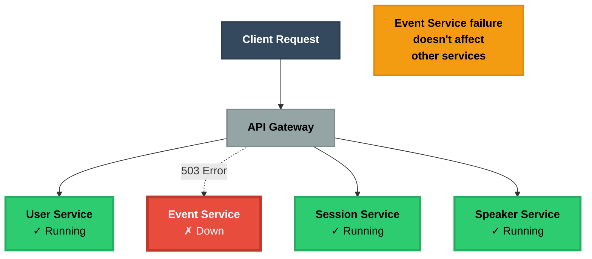

# Microservices Architecture

This diagram illustrates the distributed microservices architecture where each service is independent and isolated.

## System Architecture

## Service Isolation & Independence

## Communication Patterns

### Asynchronous Communication (RabbitMQ)

**Use Cases:**
- User enrollment notifications
- Session creation events
- Speaker profile updates
- Audit logging
- Email notifications

### Synchronous Communication (gRPC)

**Use Cases:**
- Validate entity existence
- Fetch related data for responses
- Real-time consistency checks
- Immediate feedback required

## Horizontal Scaling

```mermaid
graph TB
    GW["<b>API Gateway</b>"]
    
    subgraph "User Service - 3 Instances"
        US1["<b>User Service</b><br/>Instance 1"]
        US2["<b>User Service</b><br/>Instance 2"]
        US3["<b>User Service</b><br/>Instance 3"]
    end
    
    subgraph "Event Service - 5 Instances"
        ES1["<b>Event Service</b><br/>Instance 1"]
        ES2["<b>Event Service</b><br/>Instance 2"]
        ES3["<b>Event Service</b><br/>Instance 3"]
        ES4["<b>Event Service</b><br/>Instance 4"]
        ES5["<b>Event Service</b><br/>Instance 5"]
    end
    
    subgraph "Session Service - 2 Instances"
        SS1["<b>Session Service</b><br/>Instance 1"]
        SS2["<b>Session Service</b><br/>Instance 2"]
    end
    
    subgraph "Speaker Service - 1 Instance"
        SpS1["<b>Speaker Service</b><br/>Instance 1"]
    end
    
    GW --> US1 & US2 & US3
    GW --> ES1 & ES2 & ES3 & ES4 & ES5
    GW --> SS1 & SS2
    GW --> SpS1
    
    Note["<b>Scale each service<br/>independently based<br/>on traffic patterns</b>"]
    
    style Note fill:#34495e,stroke:#2c3e50,stroke-width:2px,color:#fff
    style GW fill:#95a5a6,stroke:#7f8c8d,stroke-width:3px,color:#000
    style US1 fill:#2ecc71,stroke:#27ae60,stroke-width:2px,color:#000
    style US2 fill:#2ecc71,stroke:#27ae60,stroke-width:2px,color:#000
    style US3 fill:#2ecc71,stroke:#27ae60,stroke-width:2px,color:#000
    style ES1 fill:#3498db,stroke:#2980b9,stroke-width:2px,color:#fff
    style ES2 fill:#3498db,stroke:#2980b9,stroke-width:2px,color:#fff
    style ES3 fill:#3498db,stroke:#2980b9,stroke-width:2px,color:#fff
    style ES4 fill:#3498db,stroke:#2980b9,stroke-width:2px,color:#fff
    style ES5 fill:#3498db,stroke:#2980b9,stroke-width:2px,color:#fff
    style SS1 fill:#e74c3c,stroke:#c0392b,stroke-width:2px,color:#fff
    style SS2 fill:#e74c3c,stroke:#c0392b,stroke-width:2px,color:#fff
    style SpS1 fill:#f39c12,stroke:#d68910,stroke-width:2px,color:#000
```

**Benefits:**
- Scale high-traffic services (Events) more than low-traffic services (Speakers)
- Optimal resource utilization
- Cost-effective scaling

## Deployment Architecture

## Data Isolation

**Data Ownership:**
- User Service: User accounts and authentication
- Event Service: Event information and enrollments
- Session Service: Session details and speaker associations
- Speaker Service: Speaker profiles

## Service Discovery & Health Checks

## Fault Isolation

**Resilience:**
- One service failure doesn't crash entire system
- Partial functionality remains available
- Circuit breakers prevent cascading failures

## Advantages

### Benefits
- **Independent Scaling**: Scale services based on load
- **Technology Flexibility**: Use different tech per service
- **Fault Isolation**: Service failures don't cascade
- **Team Autonomy**: Teams own complete services
- **Easier Updates**: Deploy services independently
- **Optimized Resources**: Right-size each service
- **Parallel Development**: Multiple teams work simultaneously

### Challenges
- **Increased Complexity**: More moving parts
- **Network Latency**: Inter-service communication overhead
- **Distributed Transactions**: Data consistency challenges
- **DevOps Overhead**: Requires orchestration and monitoring
- **Debugging Difficulty**: Tracing requests across services
- **Data Duplication**: Some data replicated across services