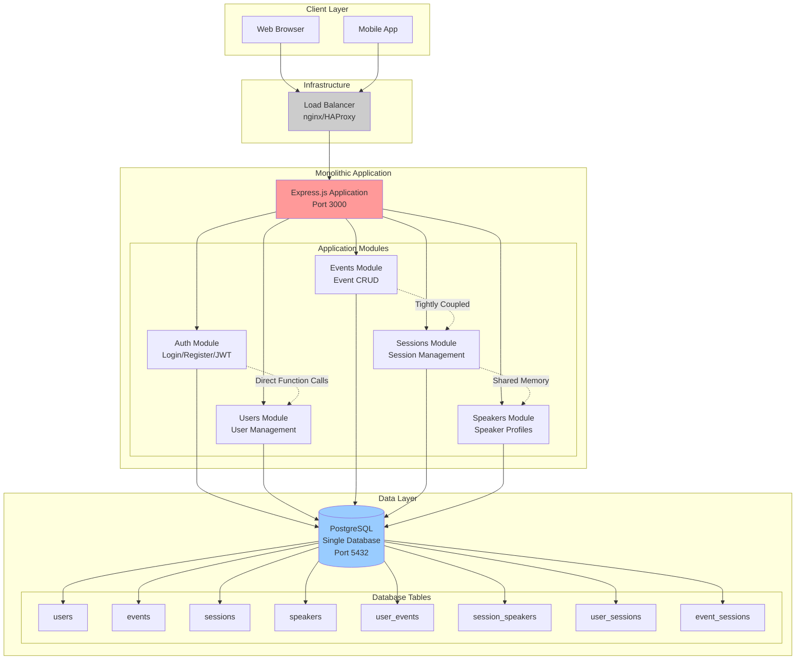
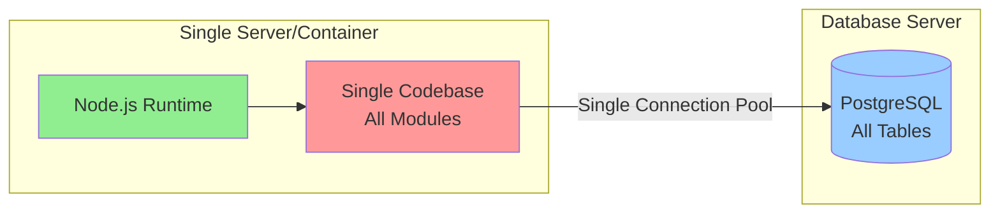
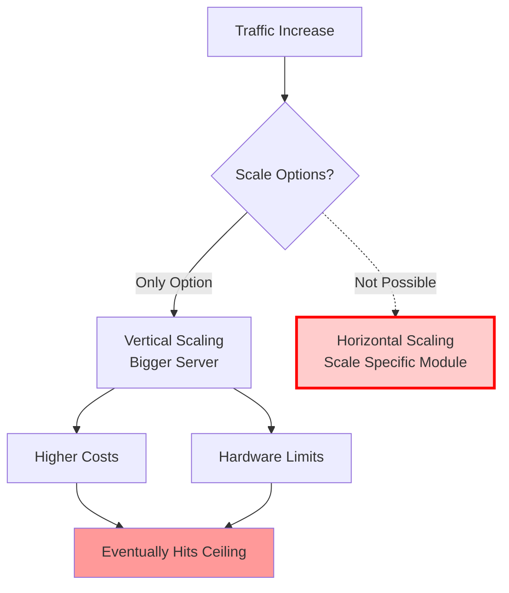
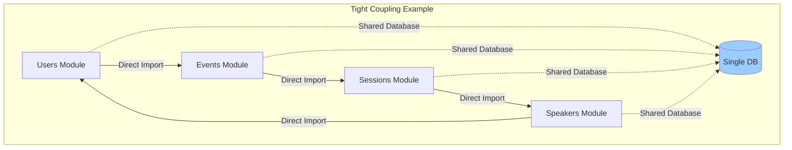
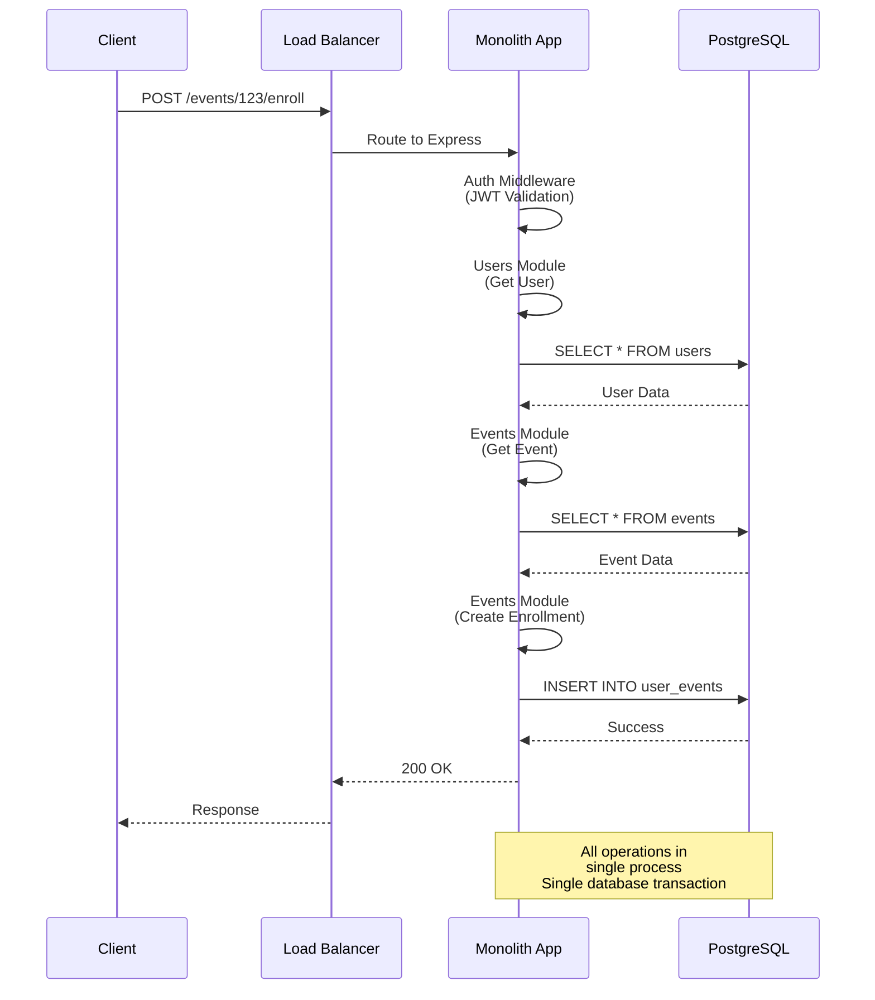
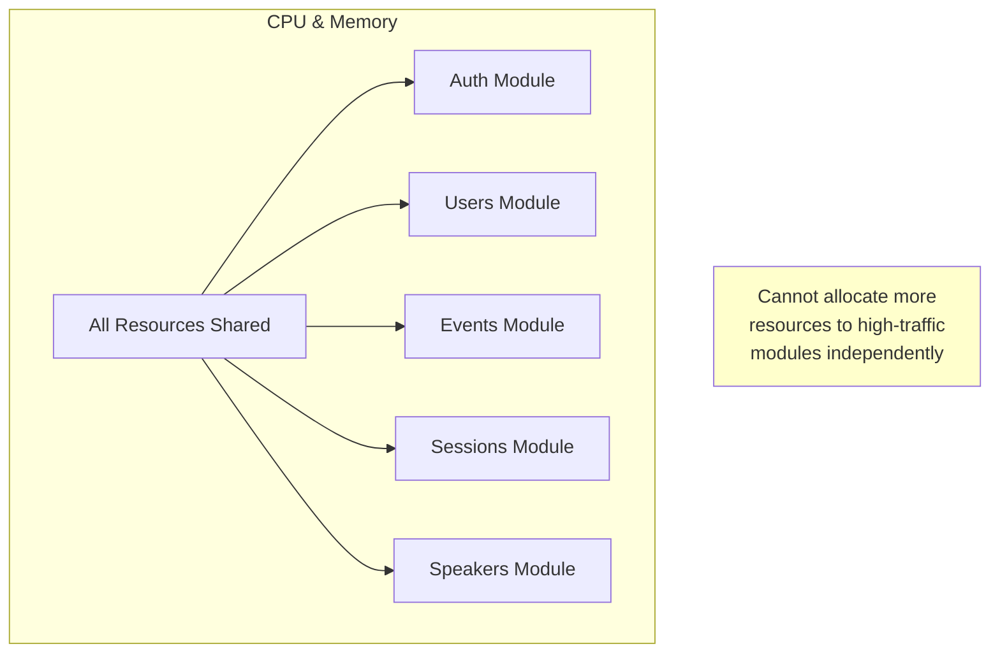

# Monolithic Architecture

This diagram illustrates the traditional monolithic architecture where all components run in a single application.

## System Architecture

## Deployment Architecture

## Characteristics

### Advantages
- **Simple Deployment**: Single Docker container or process
- **Easy Development**: All code in one repository
- **Direct Function Calls**: No network latency between modules
- **ACID Transactions**: Database transactions across all tables
- **Easier Debugging**: Single log file, single process to debug
- **Lower Infrastructure Costs**: One server, one database

### Limitations
- **Vertical Scaling Only**: Must upgrade entire server
- **Single Point of Failure**: If app crashes, everything is down
- **Technology Lock-in**: All modules must use same tech stack
- **Deployment Risk**: Small change requires full redeployment
- **Team Conflicts**: Multiple developers working on same codebase
- **Resource Inefficiency**: Cannot scale individual features
- **Long Startup Time**: Must load all modules on startup

## Scalability Bottlenecks

## Module Coupling

**Impact of Coupling:**
- Changes in one module can break others
- Difficult to replace or upgrade individual modules
- Testing requires entire application
- Cannot use different technologies per module

## Typical Request Flow

## Resource Usage Pattern

**Problem**: If Events module needs more CPU, entire application must be scaled up.