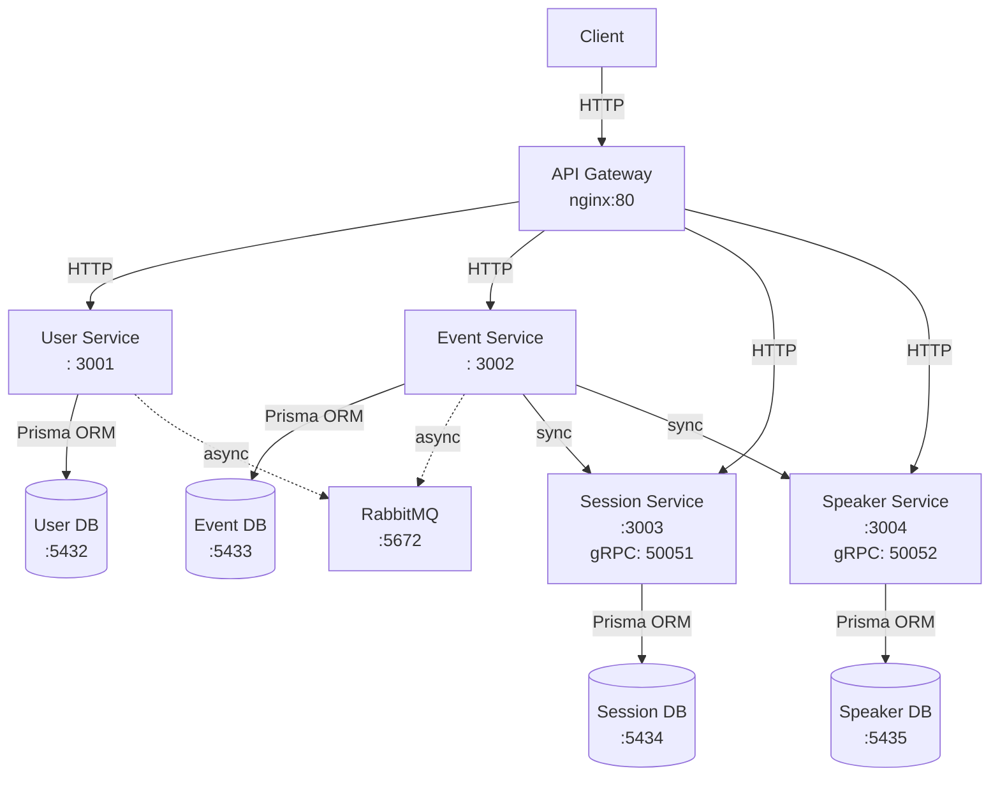

# Microservices Backend - Event Management System

Distributed microservices backend for event, session, speaker, and user management. Scalable architecture with asynchronous (RabbitMQ) and synchronous (gRPC) communication.

## Architecture


## Getting Started

- **[SETUP.md](./SETUP.md)** - Complete setup instructions for development and production
- **[API.md](./API.md)** - Full API documentation with examples

## Project Structure

```
microservices/
├── docker-compose.yml              # Orchestration
├── README.md                       # This file
├── API.md                          # API documentation
├── SETUP.md                        # Setup and config
│
├── api-gateway/                    # Nginx
│   ├── Dockerfile
│   └── nginx.conf
│
├── user-service/                   # Port 3001
│   ├── prisma/schema.prisma
│   ├── src/
│   │   ├── modules/
│   │   │   ├── auth/
│   │   │   └── users/
│   │   ├── messaging/
│   │   └── shared/
│   ├── package.json
│   └── Dockerfile
│
├── event-service/                  # Port 3002
│   ├── prisma/schema.prisma
│   ├── src/
│   │   ├── modules/events/
│   │   ├── messaging/
│   │   └── shared/
│   ├── package.json
│   └── Dockerfile
│
├── session-service/                # Port 3003, gRPC 50051
│   ├── prisma/schema.prisma
│   ├── proto/session.proto
│   ├── src/
│   │   ├── modules/sessions/
│   │   ├── grpc/
│   │   ├── messaging/
│   │   └── shared/
│   ├── package.json
│   └── Dockerfile
│
└── speaker-service/                # Port 3004, gRPC 50052
    ├── prisma/schema.prisma
    ├── proto/speaker.proto
    ├── src/
    │   ├── modules/speakers/
    │   ├── grpc/
    │   ├── messaging/
    │   └── shared/
    ├── package.json
    └── Dockerfile
```

## Troubleshooting

### Service doesn't start

```bash
# View service logs
docker compose logs user-service

# Check if port is occupied
lsof -i :3001

# Rebuild service
docker compose up -d --build user-service
```

### Database doesn't connect

```bash
# Check if database is running
docker compose ps user-db

# View database logs
docker compose logs user-db

# Restart database
docker compose restart user-db

# Complete reset (DELETES DATA!)
docker compose down user-db
docker volume rm microservices_user_db_data
docker compose up -d user-db
```

### RabbitMQ doesn't connect

```bash
# Check logs
docker compose logs rabbitmq

# Restart RabbitMQ
docker compose restart rabbitmq

# Check connections in Management UI
open http://localhost:15672
```

### gRPC doesn't connect

```bash
# Check if port is open
nc -zv localhost 50051
nc -zv localhost 50052

# View gRPC service logs
docker compose logs session-service | grep -i grpc
docker compose logs speaker-service | grep -i grpc
```

### Migration Error

```bash
# Inside service folder
cd user-service

# View status
npx prisma migrate status

# Resolve manually
npx prisma migrate resolve --applied "migration_name"

# Or reset (DELETES DATA!)
npx prisma migrate reset
```

### Port already in use

```bash
# Find process using the port
lsof -i :3001

# Kill the process
kill -9 <PID>

# Or change port in docker-compose.yml
```