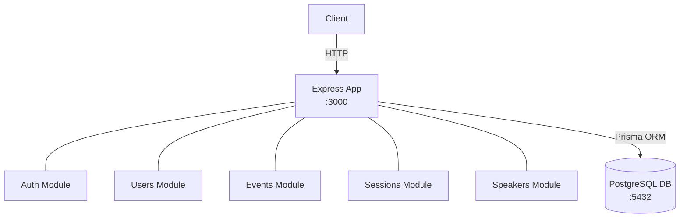

# Monolithic Backend Architecture

A traditional single-application backend with all features in one codebase.

## Architecture Overview



All modules (Auth, Users, Events, Sessions, Speakers) run in the same process and share the same database.

## Getting Started

- **[SETUP.md](./SETUP.md)** - Complete setup instructions for development and production
- **[API.md](./API.md)** - Full API documentation with examples

## Project Structure

```
monolith/
├── prisma/
│   └── schema.prisma               # Complete database schema (8 models)
├── src/
│   ├── modules/
│   │   ├── auth/                   # Authentication (register, login, me)
│   │   │   ├── controller.ts       # Request handlers
│   │   │   ├── service.ts          # Business logic
│   │   │   ├── routes.ts           # Route definitions
│   │   │   └── validation.ts       # Zod schemas
│   │   ├── events/                 # Event management (CRUD, enroll/leave)
│   │   │   ├── controller.ts
│   │   │   ├── service.ts
│   │   │   ├── routes.ts
│   │   │   └── validation.ts
│   │   ├── sessions/               # Session management (CRUD, speakers, attendance)
│   │   │   ├── controller.ts
│   │   │   ├── service.ts
│   │   │   ├── routes.ts
│   │   │   └── validation.ts
│   │   ├── speakers/               # Speaker management (CRUD)
│   │   │   ├── controller.ts
│   │   │   ├── service.ts
│   │   │   ├── routes.ts
│   │   │   └── validation.ts
│   │   └── users/                  # User management (CRUD, password, events)
│   │       ├── controller.ts
│   │       ├── service.ts
│   │       ├── routes.ts
│   │       └── validation.ts
│   ├── shared/
│   │   ├── middleware/
│   │   │   ├── authMiddleware.ts   # JWT authentication & authorization
│   │   │   └── errorHandler.ts     # Global error handler
│   │   └── utils/
│   │       ├── jwt.ts              # Token generation & verification
│   │       └── logger.ts           # Winston logger
│   ├── app.ts                      # Express app configuration
│   └── server.ts                   # Server entry point
├── .env                            # Environment variables (create from .env.example)
├── .env.example                    # Environment template
├── .gitignore                      # Git ignore patterns
├── API.md                          # API documentation
├── docker-compose.yml              # Local development stack
├── Dockerfile                      # Multi-stage production build
├── package-lock.json               # Locked dependency versions
├── package.json                    # Dependencies & scripts
├── README.md                       # This file
├── SETUP.md                        # Setup instructions
└── tsconfig.json                   # TypeScript configuration
```

## Troubleshooting

### Database Connection Issues
```bash
# Check if PostgreSQL is running
docker compose ps

# View PostgreSQL logs
docker compose logs postgres

# Restart database
docker compose restart postgres
```

### Migration Issues
```bash
# Reset database (CAUTION: deletes all data)
npx prisma migrate reset

# Create new migration
npx prisma migrate dev --name your_migration_name
```

### TypeScript Errors
```bash
# Regenerate Prisma Client
npx prisma generate

# Clean build
rm -rf dist node_modules
npm install
npm run build
```